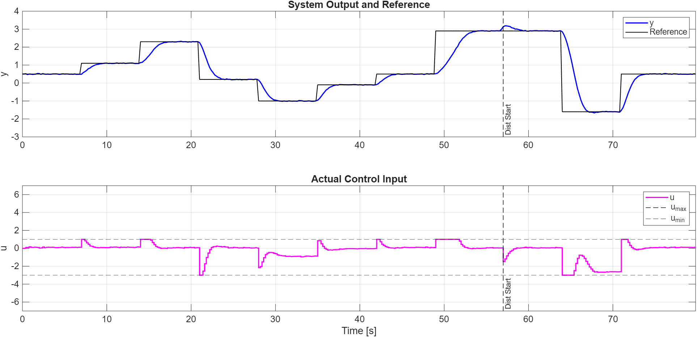

# Model-Predictive-Control
This repository includes the MATLAB codes for a Dynamic Matrix Controller (DMC) and an Extended Predictive Functional Controller (EPFC). These two are basic types of Model-Predictive Control (MPC). The code can handle all sorts of model horizon, prediction horizon, control horizon, or gain tuning, along with mismatched model, control input limits, etc. 

Here is a very simple example of the reference tracking in presence of control input saturation:

## Documentation
Two dedicated README files are provided for DMC and EPFC, each with extensive algorithm introduction and implemenation details:
- [DMC document](/docs/DMC.md)
- [EPFC document](/docs/EPFC.md)

## Quick Start
To start using the controllers with your own system, all you have to do is define your system's dynamics in two folders:
- [This](/+systems/+actual/) is where you define your true system dynamics.
- [This](/+systems/+model/) is where you define your system's model.
In case of no model mismatch, set both to the same dynamics. 

After that, you can use simple demo scripts for [DMC](/scripts/dmc/main.m) and [EPFC](/scripts/epfc/main.m). 

_Note_: For EPFC, you have two options for linearizing your system:
- Using the Jacobian of your system, which has to be defined [here](/+systems/+model/+epfc/linearize_dynamics.m).
- Using the perturbation method, which applies two step responses to the model and subtracts their responses to get a linearized model. In this case, you don't have to do anything. The logic is already defined [here](/+systems/+model/+epfc/get_step_response_nonlinear.m).

## Overall Architecture
There are three main folders:
- [+controllers](/+controllers/) is where the two controller classes are defined.
- [+systems](/+systems/) is where the system is defined. This is where you can define your own system. Inside, there are two folders:
    - [+actual](/+systems/+actual/) is where you define your true system dynamics.
    - [+models](/+systems/+model/) is where the model of the system is defined that will be used by the controllers.
In case of no model mismatch, both systems should be set to the same dynamics in these folders. Otherwise, you can simply enter different dynamics for the actual system and its model. 
- [scripts](/scripts/) is where all the scripts are saved. There are prewritten scripts for comparing almost all the tuning parameters. There are also general demo scripts that can be used for simple assessment of the controllers.

## Contribution
This repo is maintained by [me](https://github.com/MRGilak). Contributions are welcome as well.

