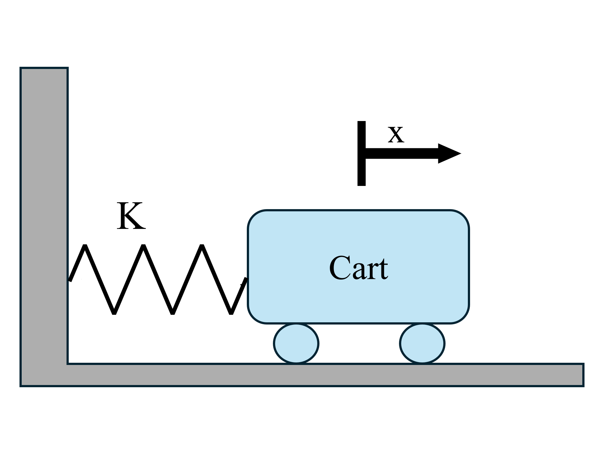

## EPFC
An extended PFC controller is implemented to control a nonlinear system. The exemplar system considered is a cart with a nonlinear spring attached to it, as shown in the image:



The system state space representation is as follows:

$$
    \begin{align}
        \dot{x}_1 = x_2 \\
        \dot{x}_2 = -0.33 e^{-x_1} x_1 - 1.1 x_2 + u
        y = x_1
    \end{align}
$$

Any other system can be used instead. It's simply a matter of system definition in one function, which will be shown later.
A change of variables is considered as:

$$
    v = u + x_1
$$

This change of variables allows the new system to have a one-to-one relationship between `v` and `y`. If a system does not need a change of variables, line 162 of `run_simulation` can simply be changed to:
```matlab
u = v;
```
A very simple explanation of EPFC is included in [this file](EPFC.pdf).

### EPFC functions
The functions and scripts are as follows:
- [run_simulation](../utils/epfc/simulate_closed_loop.m) runs the simulation given the linearization method, which can be set to either `perturbation` or `jacobian`. `jacobian` uses the provided Jacobian of the system (which should be provided in [linearize_dynamics](../+systems/+model/+epfc/linearize_dynamics.m)). The perturbation method uses the predictive model and applies two inputs. One where the input is kept unchanged as it is at this sample time, and one with a small change in the control input value. By dividing the change of the output in the two cases by the change of the input, a linearized model is achieved.
- [linearize_dynamics](../+systems/+model/+epfc/linearize_dynamics.m) provides the jacobian for the `jacobian` lineariztion method. You should set this function according to your system's dynamics.
- [get_step_response_nonlinear](../+systems/+model/+epfc/get_step_response_nonlinear.m) provides the outputs for a given constant input. It is used in `perturbation` linearization technique.
- [update_nonlinear_state](../+systems/+model/+epfc/update_nonlinear_state.m) moves the nonlinear system's dynamics forward one step. You can insert your system dynamics here.

A considerably smaller step size (compared to control sample time) should be considered when simulating the nonlinear system itself. The `substeps` parameter can be tuned for that (keep it at least at 10 for a realistic simulation).
- [update_nonlinear_state](../+systems/+actual/+epfc/update_nonlinear_state.m) is used when model mismatch is considered. You can set this the same as [here](../+systems/+model/+epfc/update_nonlinear_state.m) if your model is exact. If not, use the model at hand in [update_nonlinear_state](../+systems/+model/+epfc/update_nonlinear_state.m) and in [here](../+systems/+actual/+epfc/update_nonlinear_state.m) write the actual system model (unknown). 
- [plot_simulation_results](../utils/epfc/plot_simulation_results.m) and [plot_comparison_results](../utils/epfc/plot_comparison_results.m) are used for plotting and saving the outputs. The outputs are saved in a folder called `simulation_results` in `downloads` (on Windows). If no such folder exists, one will be created. (I will probably remove this in the future or rather make it optional)

### EPFC scripts
- [plot_static_gain](../utils/dmc/plot_static_gain.m) is used for analyzing the nonlinear system static gain and consider a change of variables if necessary
- [main](../scripts/epfc/main.m) runs the simulation with the set parameters and saves the results. Parameters include:
    - `Ts` sampling time
    - `tf` final simulation time
    - `N-model` not actually used in PFC, but set it to something larger than all the `mu`s
    - `mu` output coincidence points
    - `m` input coincidence points (degrees of freedom)
    - `q` weight of each output coincidence point (same size as `mu`)
    - `r` weight of each input coincidence point (same size as `m`)
    - `psi` filter coefficients for filtering the desired reference (same size as 'mu')
    - `u_min`, `u_max` control input saturation lower and higher limits. Note that no saturation is actually applied to the input, but these are passed to the MPC controller which then calculates the control input as to not violate these constraints.
    - `x0` initial condition of the system
    - `u0` initial control input
    - `beta`, `Ni` and `TOL` are used when finding `D_nonlinar`. 
    - `method` determines the linearization method: 'jacobian' or 'perturbation'
    - `is_programmed_ref`: if set to true, the reference will be considered programmed, meaning that the controller is aware of the future values of the reference signal.
    - `noise_power` power of white noise on the output
    - `dist_amp` the amplitude of disturbance on the output. The disturbance is considered to be a pulse signal.
    - `dist_time` the time when the disturbance is applied
    - `dist_duration` the duration of the disturbance
- [one_input_one_output](../scripts/epfc/one_input_one_output.m) simulates the system for one input and one output coincidence points.
- [one_input_three_outputs](../scripts/epfc/one_input_three_outputs.m) simulates the system for one input and three output coincidence points.
- [one_input_three_outputs](../scripts/epfc/three_inputs_three_outputs.m) simulates the system for three input and three output coincidence points.
- [compare_coincidence_points](../scripts/epfc/compare_coincidence_points.m) compares the three cases above.
- [compare_input_coincidence_points](../scripts/epfc/compare_input_coincidence_points.m) compare different sets of input coincidence points.
- [compare_output_coincidence_points](../scripts/epfc/compare_output_coincidence_points.m) compare different sets of output coincidence points.
- [compare_constrained_vs_unconstrained](../scripts/epfc/compare_constrained_vs_unconstrained.m) compares the controller performance in presence and absence of input constraints.
- [compare_linearization_methods](../scripts/epfc/compare_linearization_methods.m) compares 'perturbation' and 'jacobian' linearization methods.
- [compare_q_values](../scripts/epfc/compare_q_values.m) compares different values of q. 
- [compare_r_values](../scripts/epfc/compare_r_values.m) compares different values of r.
- [compare_psi_values](../scripts/epfc/compare_psi_values.m) compares different values of psi.
- [compare_nominal_vs_uncertainty](../scripts/epfc/compare_nominal_vs_uncertainty.m) compares the controller performance in presence and absence of uncertainty in the model. (for some reason, this script does not work now, I'll fix this in future releases)
- [compare_programmed](../scripts/epfc/compare_programmed.m) compares programmed vs unprogrammed reference signal.
- [noise_and_disturbance](../scripts/epfc/noise_and_disturbance.m) is just [main](../scripts/epfc/main.m) with more noise and disturbance to see their effects.
- [initial_condition](../scripts/epfc/initial_condition.m) is just [main](../scripts/epfc/main.m) with different initial conditions to see their effects.
